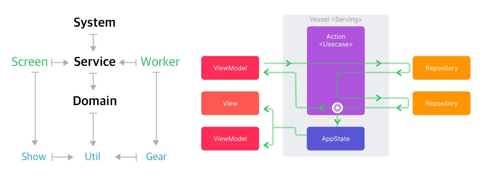

# PurePYQ

Python 과 Qt 를 이용해 만든 데스크톱 앱입니다. 자세한 설명은 아래 블로그 포스트에 있습니다.

* [파이썬 QT 데스크톱 앱](https://kiroshin.github.io/2024-10-07-python-qt-desktop-app)

### 작동 환경
- [Python](https://www.python.org) 3.11 이상, [PySide](https://doc.qt.io/qtforpython-6/) 6.5 이상의 맥과 윈도우에서 작동합니다.
- [Nuitka](https://nuitka.net) 를 이용해 컴파일했습니다.
- [Actual Installer](https://www.actualinstaller.com) 를 통해 패키징했습니다.

## 관련 프로젝트
* [Pure Android Project](https://github.com/kiroshin/PureAOS)
* [Pure iOS Project](https://github.com/kiroshin/PureIOS)

### 관련 포스트
* [아키텍처(MVC를 위한 변명)](https://kiroshin.github.io/2024-07-15-architecture)
* [정말 튼튼한 아키텍처](https://kiroshin.github.io/2024-07-17-pure-simple)
* [미니멀로 구성하기](https://kiroshin.github.io/2024-07-22-hello-pure)

## 윈도우 설치
다운로드: https://github.com/kiroshin/PurePYQ/releases/download/0.1.0/setup_pure_win10_x64.exe

윈도우 디펜더 스마트스크린을 통과하려면 마이크로소프트에 따로 제출하거나, 명성치를 쌓아야 하는 다른 절차가 필요합니다. 테스트용 앱인데 그런 것까지 하지는 않았습니다. 따라서 아래와 같이 `추가정보` 를 클릭하여 `실행` 버튼을 다시 눌러줘야 합니다. 아무래도 멀웨어 앱이 하도 많다보니 어쩔 수 없나 봅니다.

### 참고
맬웨어가 전혀 없는데도 불구하고 72개 업체 중 8개 업체가 오탐지합니다. 정식 앱이 아니라서 제가 직접 코드 사이닝을 했기 때문에 그런 것 같습니다. 인증서를 구입하고 정식 서명을 한다면 문제 없을 것 같네요.
* [virustotal](https://www.virustotal.com/)

